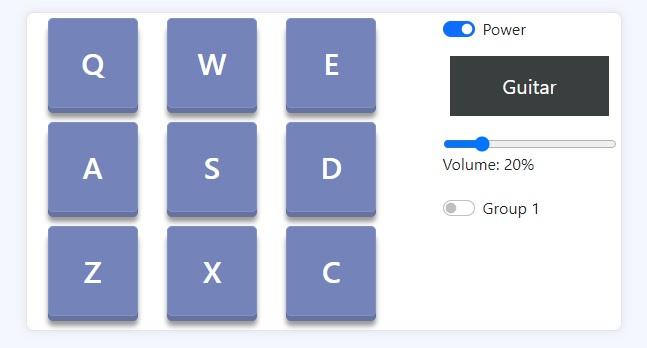
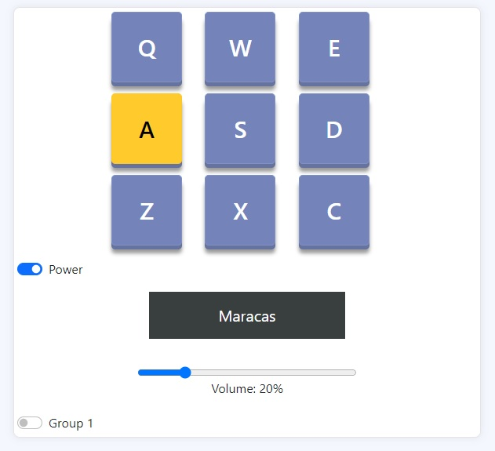
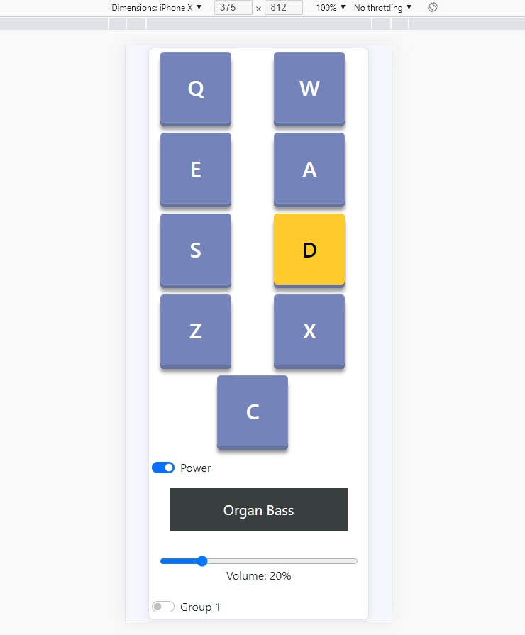

# Redux Drum Machine
Redux Drum Machine is developed on **React.js** and implemented **Redux** for states management. this React component serves as an alternative to acoustic, strings, brass, and percussion instruments such as: 

- Drum
- Piano
- Guitar
- Cello
- Gong
- Flute

## Demo
- -> [Online Demo](https://ceedeno.github.io/drum-machine-demo/)

## Dependencies

- React Redux 7.1+
- Bootstrap v5+

## Components

- **Drum-Pad**. each button plays a different instrument.
- **Power switch**.
- **Display**. It shows the instrument name.
- **Volumen scale**.
- **Group Switch**. The Drum Machines has two groups of instruments you can play.

## Responsive Design

### Tablets:

### Phones: 

